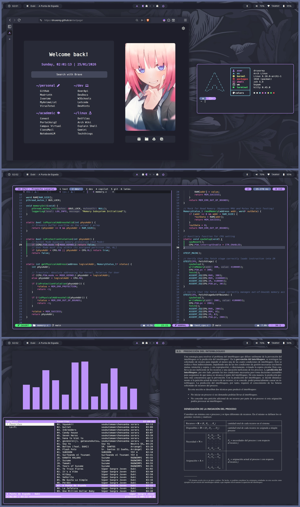

<h1 align="center">Dotfiles</h1>

<p align="center">A minimalist repository of my dotfiles for arch linux</p>

<p align="center">
	<a href="https://github.com/druxorey/dotfiles/stargazers">
		
	</a>
	<a href="https://github.com/druxorey/dotfiles">
		
	</a>
	<a href="https://visitorbadge.io/status?path=https%3A%2F%2Fgithub.com%2Fdruxorey%2Fdotfiles">
		
	</a>
	<a href="https://github.com/druxorey/dotfiles/blob/main/LICENSE.md">
		
	</a>
</p>

## About

This repository contains the configuration files, scripts, and themes that make up my daily computing environment. The core of this setup is built on **Arch Linux** and **BSPWM**, an extremely fast and minimal tiling window manager, controlled entirely via keybindings with **SXHKD**, allowing a highly productive, keyboard-driven workflow.

The entire aesthetic of this rice is unified by the **Dracula** color palette for the dark theme and **Alucard** for it's light variant, ensuring a consistent and elegant look across all applications.

## Installation

Bootstrapping a new Arch Linux installation can be tedious, that's why I created the [`drxboot.sh`](drxboot.sh) script to automate the entire process.

This script features a terminal-based UI (using `dialog`) that handles system updates, installs essential packages (from Pacman and the AUR), enables necessary system services, and configures the ZSH shell. It allows four distinct installation profiles:

- **Server:** A basic installation that sets up essential tools with a minimal footprint. Perfect for headless environments without GUI bloat.
	
- **Minimal:** A richer CLI environment that includes everything from the Server profile, plus additional terminal tools, ZSH configuration, and basic dotfiles syncing.
	
- **Desktop:** The complete GUI experience. Installs everything in the Minimal profile alongside the graphical interface (Xorg, BSPWM, Polybar, Kitty, Rofi) and all desktop customizations.
	
- **Custom:** An interactive wizard that lets you hand-pick exactly which Pacman/AUR packages to install, choose whether to copy dotfiles, enable specific services, or set up ZSH manually.

To execute the script without saving the file locally:

```bash
bash <(curl -s https://druxorey.github.io/dotfiles/drxboot.sh)
```

Alternatively, to download and execute the installation wizard directly, run:

```bash
curl -O https://druxorey.github.io/dotfiles/drxboot.sh
bash drxboot.sh
```

## Showcase

Here is a glimpse of how the desktop looks in action. More screenshots showcasing different tools and workflows will be added here in the future.




## Overview

This environment relies on several powerful tools configured to work together:

- **Polybar:** A highly customizable status bar. I have configured it with custom scripts to display system modules, music status (Cmus), active processes, and Bluetooth connections in a clean, minimalist way.
	
- **Rofi:** I have heavily customized Rofi with different modules to act as a general system menu, Wi-Fi manager, power menu, wallpaper selector, quick search utility and **a custom theme-switcher**, toggling between the Dracula (dark) and Alucard (light) color schemes.
	
- **Kitty:** My primary terminal emulator. It is GPU-accelerated, highly configurable, visually integrated with the overall theme, and supports native image rendering.
	
- **Neovim:** My primary text editor, heavily customized for programming, markdown writing, and task management. This setup is built on top of the powerful **LazyVim** framework.
		
- **Yazi:** A blazing fast terminal file manager written in Rust, integrated with various plugins for previews and server management.
	
- **Obsidian:** Used for note-taking and knowledge management, completely themed to match the Dracula/Alucard aesthetic.

## Keybindings

This setup is designed to be highly keyboard-centric. Below are some of the most important keybindings configured in `sxhkd`.

<table align="center">
	<tr>
		<th colspan="2" align="center">Applications</th>
		<th colspan="2" align="center">Menus & Prompts (Rofi)</th>
	</tr>
	<tr>
		<td><code>Super + Return</code></td>
		<td>Open Terminal (Kitty)</td>
		<td><code>Super + Space</code></td>
		<td>General System Menu</td>
	</tr>
	<tr>
		<td><code>Super + b</code></td>
		<td>Open Browser (Brave)</td>
		<td><code>Super + Home</code></td>
		<td>Application Launcher</td>
	</tr>
	<tr>
		<td><code>Super + e</code></td>
		<td>Terminal File Manager (Yazi)</td>
		<td><code>Super + p</code></td>
		<td>Music Manager / Player</td>
	</tr>
	<tr>
		<td><code>Super + Alt + e</code></td>
		<td>GUI File Manager (Thunar)</td>
		<td><code>Super + Insert</code></td>
		<td>Quick Search Manager</td>
	</tr>
	<tr>
		<td><code>Super + c</code></td>
		<td>Text Editor (Neovim)</td>
		<td><code>Super + v</code></td>
		<td>Clipboard Manager</td>
	</tr>
	<tr>
		<td><code>Super + o</code></td>
		<td>Open Obsidian</td>
		<td><code>Super + Shift + Esc</code></td>
		<td>Reload sxhkd config</td>
	</tr>
	<tr>
		<th colspan="2" align="center">System & Media</th>
		<th colspan="2" align="center">Window Management</th>
	</tr>
	<tr>
		<td><code>Print</code></td>
		<td>Screenshot (Flameshot)</td>
		<td><code>Super + w</code></td>
		<td>Close Window</td>
	</tr>
	<tr>
		<td><code>Super + Print</code></td>
		<td>Color Picker</td>
		<td><code>Super + m</code></td>
		<td>Tiled / Monocle Layout</td>
	</tr>
	<tr>
		<td><code>Media Keys</code></td>
		<td>Volume & Playback Control</td>
		<td><code>Super + , / .</code></td>
		<td>Switch BSPWM Layout</td>
	</tr>
	<tr>
		<td><code>Brightness Keys</code></td>
		<td>Adjust Screen Light</td>
		<td><code>Super + Tab</code></td>
		<td>Focus Next Window</td>
	</tr>
	<tr>
		<td><code>Super + F1-F12</code></td>
		<td>Quick Access Websites</td>
		<td><code>Super + [1-0]</code></td>
		<td>Focus Desktop 1-10</td>
	</tr>
</table>

For the complete list of shortcuts, check the full [sxhkdrc](config/sxhkd/sxhkdrc) file,

## Custom Scripts

To maintain and manage this environment, I have developed several custom tools. These scripts are hosted in my [drxutils repository](https://github.com/druxorey/drxutils "null"). Here are the most important ones:

1. `sysupdate`: A system maintenance script. Running this script automates the update of Pacman packages, AUR packages (via `yay`), Yazi plugins, and Discord (Vencord). It also performs system cleanup by clearing old cache files (respecting a whitelist) and emptying the trash bin. Finally, it pulls the latest version of the `drxutils` repository and compiles any updated Go projects automatically.

2. `dotbak`: My personal backup utility. It uses `rsync` to safely copy all my active configuration files from `~/.config` and other system locations directly into this local dotfiles repository directory. It even parses and backs up my Brave browser bookmarks into a clean YAML format.

3. `packages`: A package manager helper written in Go. This CLI tool allows me to add, search, and remove packages from [`drxboot.packages`](drxboot.packages). It automatically queries `pacman` and the AUR to verify if a package exists, and then categorizes it into `Server`, `Minimal`, or `Desktop` environments. This generated list is what `drxboot.sh` uses during a fresh installation.

## License

This project is licensed under the GPL-3.0 License. See the [LICENSE](LICENSE) file for more details.
